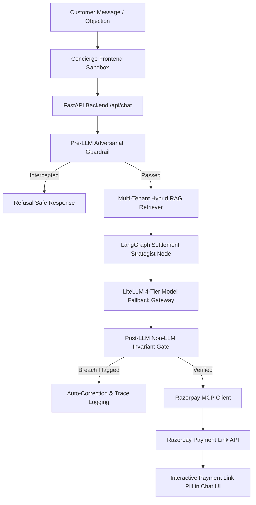

# 🛡️ AutonomePay — Autonomous Financial Concierge & Settlement Sentinel

> **Razorpay AI Buildathon Submission**  
> An autonomous multi-agent revenue recovery engine that negotiates subscription renewals, resolves failed payment friction, enforces deterministic non-LLM policy guardrails, and issues instant Razorpay Payment Links over the Model Context Protocol (MCP).

---

[](https://razorpay.com)
[](https://langchain.com)
[](https://litellm.ai)
[](https://razorpay.com)
[](LICENSE)

---

## 🔗 Quick Links & Demos

- 🌐 **Live Web Application Demo:** [https://autonomepay.vercel.app](https://autonomepay.vercel.app) *(Replace with your deployed Vercel URL)*
- 🎬 **Video Walkthrough & Architecture Tour:** [Watch YouTube Demo](https://youtube.com/watch?v=your_video_id) *(Replace with your YouTube URL)*
- 📦 **GitHub Repository:** [https://github.com/ShriHarieVigneshRD/AutonomePay.git](https://github.com/ShriHarieVigneshRD/AutonomePay.git)

---

## 💡 The Problem: The \$2.4B Subscription Churn Crisis

Traditional payment failure recovery (dunning) relies on **static SMS and Email reminders** ("Your payment failed, click here to retry"). 
- **< 12% Recovery Rate:** Static dunning fails because customers have real financial friction — temporary cash flow shortages, bank issuer downtime, plan mismatches, or partial goods disputes.
- **High Involuntary Churn:** Merchants lose millions of active subscribers simply because rigid billing systems cannot negotiate authorized concessions or offer flexible plan transitions.

### 🌟 The Solution: AutonomePay

**AutonomePay** introduces a **bound multi-agent AI concierge** that acts as an empathetic financial negotiator:
1. **Multi-Tenant Policy RAG:** Dynamically retrieves exact settlement rules across 15 merchant documents.
2. **Flexible Negotiation:** Offers authorized renewal discounts, plan downgrades (e.g. Hotstar Mobile Plan at INR 149), 50/50 corporate milestone splits, 30-day subscription pauses, or 3-day grace extensions.
3. **Non-LLM Invariant Guardrails:** Ensures 0% financial policy breaches using deterministic Pydantic Python circuit breakers.
4. **Razorpay MCP Tool Execution:** Generates live, test-checked Razorpay Payment Links (`https://rzp.io/...`) rendered as interactive action pills directly inside the chat UI.
5. **Human Escalation & Graceful Exit:** Escalates complex disputes or unauthorized fraud claims to human specialists with support tickets (`#ESC-XXXXXX`), while gracefully respecting customer cancellations with zero payment pressure.

---

## 🏗️ System Architecture



### 🧠 Core Technology Stack

- **Frontend:** React 18, Tailwind CSS, Framer Motion, Phosphor Icons, Axios
- **Backend Framework:** FastAPI (Python 3.11), Uvicorn, Pydantic v2
- **Agent Orchestration:** LangGraph (State Machine Trajectory Control)
- **Model Gateway:** LiteLLM Proxy with 4-Tier Preference Chain:
  1. `openrouter/minimax/minimax-m3:free` (Primary)
  2. `openrouter/minimax/minimax-m2.7:free` (Secondary)
  3. `openrouter/nvidia/nemotron-3-ultra-550b-a55b:free` (Third)
  4. `openrouter/openrouter/free` (Fallback)
- **Retrieval-Augmented Generation (RAG):** Multi-tenant Hybrid Retriever (`rank_bm25` keyword scoring + dense embeddings)
- **Payment Infrastructure:** Razorpay Model Context Protocol (MCP) Client
- **Observability:** Built-in 50-Case Batch Evaluation Matrix + LangSmith Dataset Sync

---

## 🛡️ Non-LLM Invariant Guardrails

To prevent LLM prompt injections, hallucinations, or illegal concession breaches, AutonomePay uses a **deterministic Python safety circuit breaker**:

| Invariant Check | Verification Rule | Enforcement Mechanism |
| :--- | :--- | :--- |
| **Pre-LLM Guardrail** | Regex pattern matching for system overrides, jailbreak prompts, or zero-price requests. | Intercepts adversarial input before LLM invocation. |
| **Discount Ceiling** | $\text{discount\_pct} \le \text{max\_discount\_pct}$ | Caps promotional renewal discounts to merchant database limits. |
| **Grace Period Threshold** | $\text{grace\_days} \le \text{max\_grace\_days}$ | Limits grace period extensions. |
| **Arithmetic Split Sum** | $\sum \text{split\_amounts} = \text{proposed\_amount}$ | Verifies math equality for corporate milestone splits. |
| **Plan Downgrade Isolation** | Action `PLAN_DOWNGRADE` preserves lower tier plan price (INR 149.00). | Prevents valid lower tier plan prices from being flagged as illegal discount breaches. |
| **Price Alignment** | Payment link amount matches message text 100%. | Forces Razorpay MCP tool call amount to match net price in customer text. |

---

## 🏢 15 Supported Merchant Policies & 50 Benchmark Cases

AutonomePay comes pre-loaded with **15 merchant policy RAG documents** and a **50-scenario benchmark suite**:

| Merchant | Sector | Default Plan | Policy Highlights |
| :--- | :--- | :--- | :--- |
| **Disney+ Hotstar** | OTT Entertainment | Super Plan (INR 299) | Max INR 20 discount, Mobile downgrade (INR 149), 30-day pause. No splits. |
| **Netflix India** | OTT Entertainment | Premium 4K (INR 649) | Zero discount policy, 48-hour retry window. |
| **Amazon Prime** | E-Commerce & OTT | Annual Prime (INR 1499) | 5-day grace period, pause up to 60 days. |
| **Spotify India** | Music Streaming | Duo Plan (INR 149) | 10% student concession, 3-day grace. |
| **Airtel Postpaid** | Telecom | Family Plan (INR 999) | Bill extension up to 7 days, late fee waiver. |
| **JioFiber** | Broadband | Fiber 100Mbps (INR 699) | Zero discount, instant pause. |
| **Notion SaaS** | B2B Productivity | Business Plan (INR 15,000) | 50/50 corporate milestone split for invoices > INR 10,000. |
| **Slack Workspace** | B2B Messaging | Pro Tier (INR 8,500) | 10% annual commitment discount, 7-day grace. |
| **QuickKart B2B** | Wholesale Supply | Inventory Batch (INR 85,000) | 80/20 hold resolution for partial goods disputes. |
| **RazorpayX Payroll** | Fintech & Payroll | Automated Payroll Pro | Human escalation for tax/compliance discrepancies. |

---

## ⚡ Local Setup & Development Guide

### Prerequisites
- **Python 3.11+**
- **Node.js 18+** & `npm`
- **`uv` Package Manager** (`pip install uv`)

---

### 1. Clone Repository & Setup Backend

```bash
git clone https://github.com/ShriHarieVigneshRD/AutonomePay.git
cd AutonomePay/backend

# Create virtual environment using uv
uv venv .venv

# Activate virtual environment
# Windows PowerShell:
.\.venv\Scripts\activate
# Linux/macOS:
source .venv/bin/activate

# Install backend dependencies
uv pip install -r requirements.txt
```

### 2. Configure Backend Environment Variables

Create `backend/.env` (copy from `backend/.env.example`):

```env
PROJECT_NAME=AutonomePay
API_V1_STR=/api
DATABASE_URL=sqlite:///./autonomepay.db

# OpenRouter Free / Gateway API Key
OPENROUTER_API_KEY=your_openrouter_api_key_here

# LiteLLM 4-Tier Preference Chain
PRIMARY_MODEL=openrouter/minimax/minimax-m3:free
SECONDARY_MODEL=openrouter/minimax/minimax-m2.7:free
THIRD_MODEL=openrouter/nvidia/nemotron-3-ultra-550b-a55b:free
FALLBACK_MODEL=openrouter/openrouter/free

# Razorpay Test Credentials (Live or Mock Test Keys)
RAZORPAY_KEY_ID=rzp_test_your_key_id
RAZORPAY_KEY_SECRET=your_key_secret

# LangSmith Observability (Optional)
LANGCHAIN_API_KEY=
```

### 3. Run FastAPI Backend Server

```bash
python -m uvicorn app.main:app --reload --port 8000
```
Backend will be live at: `http://localhost:8000` (API Docs: `http://localhost:8000/docs`)

---

### 4. Setup & Run React Frontend

In a new terminal tab:

```bash
cd AutonomePay/frontend

# Install dependencies
npm install

# Run Vite development server
npm run dev
```
Frontend will be live at: `http://localhost:5173`

---

## 🧪 Running the 50-Case Evaluation Benchmark

1. Open the web app at `http://localhost:5173`.
2. Click on the **`Batch Eval Matrix`** tab in the top navbar.
3. Click **`[ Run All 50 Evals ▶ ]`**.
4. The system will execute all 50 synthetic test scenarios, displaying real-time accuracy, latency, guardrail intercept rates, and KPI metrics.

---

## 🚀 Deployment Instructions

### Deploy Backend to Render

1. Connect repo to [Render.com](https://render.com).
2. Select **Web Service** using the root `render.yaml` configuration.
3. Add environment variables (`OPENROUTER_API_KEY`, `RAZORPAY_KEY_ID`, `RAZORPAY_KEY_SECRET`).

### Deploy Frontend to Vercel

1. Connect `frontend/` directory to [Vercel](https://vercel.com).
2. Set Environment Variable: `VITE_API_BASE_URL=https://your-render-backend.onrender.com`.
3. Deploy! SPA routing is pre-configured via `frontend/vercel.json`.

---

## 📄 License

Distributed under the MIT License. See `LICENSE` for details.

---
